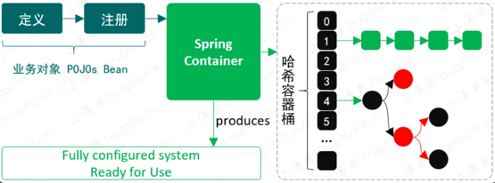
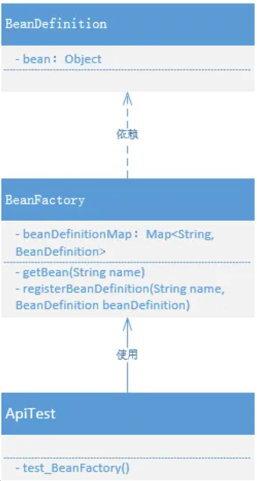

# summer
spring的学习版本，学习spring的相关理念

# 第一部分内容 
> 参考[small-spring](https://github.com/fuzhengwei/small-spring)

## Spring Bean 容器是什么？

Spring 包含并管理应用对象的配置和生命周期，在这个意义上它是一种用于承载对象的容器，你可以配置你的每个 Bean 对象是如何被创建的，这些 Bean 可以创建一个单独的实例或者每次需要时都生成一个新的实例，以及它们是如何相互关联构建和使用的。

如果一个 Bean 对象交给 Spring 容器管理，那么这个 Bean 对象就应该以类似零件的方式被拆解后存放到 Bean 的定义中，这样相当于一种把对象解耦的操作，可以由 Spring 更加容易的管理，就像处理循环依赖等操作。

当一个 Bean 对象被定义存放以后，再由 Spring 统一进行装配，这个过程包括 Bean 的初始化、属性填充等，最终我们就可以完整的使用一个 Bean 实例化后的对象了。

而我们本章节的案例目标就是定义一个简单的 Spring 容器，用于定义、存放和获取 Bean 对象。

### 设计解决
凡是可以存放数据的具体数据结构实现，都可以称之为容器。例如：ArrayList、LinkedList、HashSet等，但在 Spring Bean 容器的场景下，我们需要一种可以用于存放和名称索引式的数据结构，所以选择 HashMap 是最合适不过的。

这里简单介绍一下 HashMap，HashMap 是一种基于扰动函数、负载因子、红黑树转换等技术内容，形成的拉链寻址的数据结构，它能让数据更加散列的分布在哈希桶以及碰撞时形成的链表和红黑树上。它的数据结构会尽可能最大限度的让整个数据读取的复杂度在 O(1) ~ O(Logn) ~O(n)之间，当然在极端情况下也会有 O(n) 链表查找数据较多的情况。不过我们经过10万数据的扰动函数再寻址验证测试，数据会均匀的散列在各个哈希桶索引上，所以 HashMap 非常适合用在 Spring Bean 的容器实现上。

另外一个简单的 Spring Bean 容器实现，还需 Bean 的定义、注册、获取三个基本步骤，简化设计如下；

+ 定义：BeanDefinition，可能这是你在查阅 Spring 源码时经常看到的一个类，例如它会包括 singleton、prototype、BeanClassName 等。但目前我们初步实现会更加简单的处理，只定义一个 Object 类型用于存放对象。
+ 注册：这个过程就相当于我们把数据存放到 HashMap 中，只不过现在 HashMap 存放的是定义了的 Bean 的对象信息。
+ 获取：最后就是获取对象，Bean 的名字就是key，Spring 容器初始化好 Bean 以后，就可以直接获取了。

1. 代码结构
```ascii
small-spring-step-01
└── src
    ├── main
    │   └── java
    │       └── cn.bugstack.springframework
    │           ├── BeanDefinition.java
    │           └── BeanFactory.java
    └── test
        └── java
            └── cn.bugstack.springframework.test  
                ├── bean
                │   └── UserService.java                
                └── ApiTest.java
```

Spring Bean 容器类关系，如图



Spring Bean 容器的整个实现内容非常简单，也仅仅是包括了一个简单的 BeanFactory 和 BeanDefinition，这里的类名称是与 Spring 源码中一致，只不过现在的类实现会相对来说更简化一些，在后续的实现过程中再不断的添加内容。

+ BeanDefinition，用于定义 Bean 实例化信息，现在的实现是以一个 Object 存放对象
+ BeanFactory，代表了 Bean 对象的工厂，可以存放 Bean 定义到 Map 中以及获取。

2. Bean 定义
   com.als.summer.BeanDefinition

```java
public class BeanDefinition {

    private Object bean;

    public BeanDefinition(Object bean) {
        this.bean = bean;
    }

    public Object getBean() {
        return bean;
    }

}
```
+ 目前的 Bean 定义中，只有一个 Object 用于存放 Bean 对象。如果感兴趣可以参考 Spring 源码中这个类的信息，名称都是一样的。
+ 不过在后面陆续的实现中会逐步完善 BeanDefinition 相关属性的填充，例如：SCOPE_SINGLETON、SCOPE_PROTOTYPE、ROLE_APPLICATION、ROLE_SUPPORT、ROLE_INFRASTRUCTURE 以及 Bean Class 信息。

3. Bean 工厂
   com.als.summer.BeanFactory

```java
public class BeanFactory {

    private Map<String, BeanDefinition> beanDefinitionMap = new ConcurrentHashMap<>();

    public Object getBean(String name) {
        return beanDefinitionMap.get(name).getBean();
    }

    public void registerBeanDefinition(String name, BeanDefinition beanDefinition) {
        beanDefinitionMap.put(name, beanDefinition);
    }

}
```
+ 在 Bean 工厂的实现中，包括了 Bean 的注册，这里注册的是 Bean 的定义信息。同时在这个类中还包括了获取 Bean 的操作。
+ 目前的 BeanFactory 仍然是非常简化的实现，但这种简化的实现内容也是整个 Spring 容器中关于 Bean 使用的最终体现结果，只不过实现过程只展示出基本的核心原理。在后续的补充实现中，这个会不断变得庞大。

4. 测试类  
   com.als.summer.bean.UserService
```java
public class UserService {

    public void queryUserInfo(){
        System.out.println("查询用户信息");
    }

}
```

5. 测试用例
  com.als.summer.ApiTest
```java
@Test
public void test_BeanFactory(){
    // 1.初始化 BeanFactory
    BeanFactory beanFactory = new BeanFactory();
    
    // 2.注册 bean
    BeanDefinition beanDefinition = new BeanDefinition(new UserService());
    beanFactory.registerBeanDefinition("userService", beanDefinition);
    
    // 3.获取 bean
    UserService userService = (UserService) beanFactory.getBean("userService");
    userService.queryUserInfo();
}
```
+ 在单测中主要包括初始化 Bean 工厂、注册 Bean、获取 Bean，三个步骤，使用效果上贴近与 Spring，但显得会更简化。
+ 在 Bean 的注册中，这里是直接把 UserService 实例化后作为入参传递给 BeanDefinition 的，在后续的陆续实现中，我们会把这部分内容放入 Bean 工厂中实现。

6. 测试结果
```
查询用户信息

Process finished with exit code 0
```